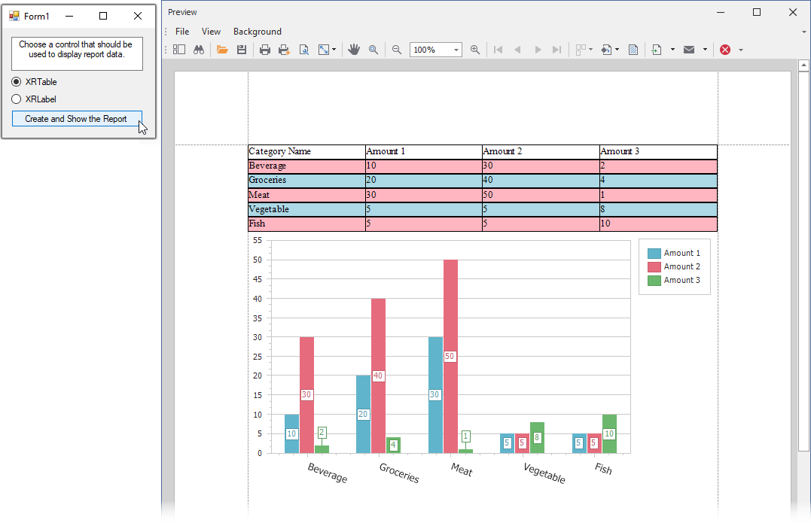

<!-- default badges list -->

<!-- default badges end -->
# Reporting for WinForms - Create a Report Dynamically and Bind It to a DataSet

This example demonstrates how to create a report dynamically and bind it to a [DataSet](https://docs.devexpress.com/XtraReports/400542). Based on a user's choice, either the [XRTable](https://docs.devexpress.com/XtraReports/DevExpress.XtraReports.UI.XRTable) or [XRLabel](https://docs.devexpress.com/XtraReports/DevExpress.XtraReports.UI.XRLabel) control is used to display report data, and the [XRChart](https://docs.devexpress.com/XtraReports/DevExpress.XtraReports.UI.XRChart) control is used to visualize this data.

If you want to create a report based on [GridControl](https://docs.devexpress.com/WindowsForms/DevExpress.XtraGrid.GridControl) data, use the [ReportGenerator](https://docs.devexpress.com/XtraReports/DevExpress.XtraReports.ReportGeneration.ReportGenerator) class as described in the following help topic: [Advanced Grid Printing and Exporting](https://docs.devexpress.com/WindowsForms/114962/controls-and-libraries/data-grid/export-and-printing/advanced-grid-printing-and-exporting).

<!-- default file list -->

## Files to Review

- [Form1.cs](./CS/Form1.cs) ([Form1.vb](./VB/Form1.vb))

<!-- default file list end -->

## Documentation

- [Reporting - Create Reports in Code](https://docs.devexpress.com/XtraReports/115726)
- [Reporting - Bind a Report to a DataSet](https://docs.devexpress.com/XtraReports/400542)
- [WinForms Controls - Advanced Grid Printing and Exporting](https://docs.devexpress.com/WindowsForms/114962)

## More Examples

- [How to dynamically generate a master-detail report in a WinForms application](https://github.com/DevExpress-Examples/Reporting_how-to-dynamically-generate-a-master-detail-report-in-a-winforms-application-e4421)
- [How to dynamically generate a report and bind it to a collection of objects in a WinForms application](https://github.com/DevExpress-Examples/Reporting_how-to-dynamically-generate-a-report-and-bind-it-to-a-collection-of-objects-e652)
- [How to create a report dynamically](https://supportcenter.devexpress.com/ticket/details/ak15900/how-to-create-a-report-dynamically)

<!-- feedback -->
## Does this example address your development requirements/objectives?

 

(you will be redirected to DevExpress.com to submit your response)
<!-- feedback end -->
